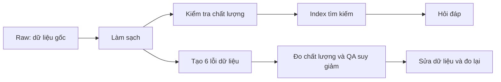

# Hướng dẫn nhánh `khoi`: cài đặt, mở demo và đưa lên GitHub

Bạn sẽ mở được một trang web trên máy mình để xem luồng xử lý dữ liệu, so sánh **Sạch → Corrupted → Repaired**, và hỏi chatbot trên từng bộ dữ liệu. Hướng dẫn chính dành cho **Windows + PowerShell**. Không cần biết lập trình, không cần Node/npm, không cần sửa mã nguồn.

> **Người nhận repo:** làm phần 1–6. **Người chuẩn bị push:** làm phần 8 trước khi gửi link cho người khác. Bản clone trên GitHub chỉ có đủ demo sau khi chủ repo hoàn tất commit/push các file trong danh sách bàn giao.

| Bạn muốn làm gì? | Đọc phần |
| --- | --- |
| Cài trên máy mới | 1–4 |
| Mở web và trình diễn | 5–6 |
| Sửa lỗi cài đặt/API | 7 |
| Chọn file, commit và push lên `khoi` | 8 |
| Hiểu giới hạn và bằng chứng bàn giao | 9 |

## 1. Chuẩn bị một lần

| Cần có | Cách chuẩn bị |
| --- | --- |
| Git | Cài từ [git-scm.com](https://git-scm.com/downloads). Dùng lựa chọn mặc định của trình cài đặt. |
| Python | Cài **Python 3.12, bản 64-bit** từ [python.org](https://www.python.org/downloads/windows/). Bật tùy chọn thêm Python vào PATH và Python Launcher nếu trình cài đặt có hỏi. Repo cho phép Python 3.11–3.13; hướng dẫn dùng 3.12. |
| Trình duyệt | Chrome hoặc Edge. |
| Internet | Cần khi tải repo, thư viện, model lần đầu và khi chat Gemini online. |
| API key Gemini | Chỉ cần cho chat online. Xem biểu đồ và chat trích xuất local không cần key, sau khi đã tải model. |

Mở **Start → gõ PowerShell → mở Windows PowerShell**. Dán từng lệnh rồi nhấn Enter; chờ lệnh chạy xong mới dán lệnh tiếp theo. Những chữ nằm ngoài khung lệnh là phần giải thích, không cần dán.

Kiểm tra:

```powershell
git --version
py -3.12 --version
```

Nếu cả hai hiện số phiên bản thì tiếp tục. Nếu vừa cài mà chưa nhận lệnh, đóng PowerShell rồi mở lại.

## 2. Tải đúng nhánh `khoi`

Trong PowerShell, chuyển đến thư mục muốn chứa dự án, ví dụ Documents:

```powershell
Set-Location ([Environment]::GetFolderPath('MyDocuments'))
git clone -c core.autocrlf=false --branch khoi --single-branch https://github.com/Palm-Pham/K4-L3B-Day10-KRAFTON-Data-Pipeline-Data-Observability.git
cd K4-L3B-Day10-KRAFTON-Data-Pipeline-Data-Observability
git branch --show-current
```

Kết quả lệnh cuối phải là `khoi`. Nếu repo riêng tư, đăng nhập GitHub bằng tài khoản được cấp quyền khi Git yêu cầu; không chèn token vào URL.

**Giữ nguyên `-c core.autocrlf=false` trong lệnh clone.** Các báo cáo/index đã được đóng dấu SHA-256 — có thể hiểu là “dấu vân tay” của file. Tự đổi xuống dòng LF/CRLF có thể làm checker báo lỗi dù nội dung nhìn giống nhau. Tùy chọn trên được lưu riêng trong bản clone này.

Từ đây, “thư mục gốc repo” là thư mục chứa `pyproject.toml`, `.env.example`, `demo/`, `src/` và `data/`. Mọi lệnh bên dưới đều chạy tại đây.

Nếu bạn đã có repo đầy đủ ở máy hiện tại, mở PowerShell tại thư mục đó và bỏ qua bước clone. Không clone đè vào thư mục đang có dữ liệu.

## 3. Cài thư viện và tải model

### 3.1. Cài theo phiên bản đã khóa

```powershell
py -3.12 -m pip install --user uv
py -3.12 -m uv sync --locked --python 3.12
```

`uv` tạo thư mục `.venv` và cài thư viện theo `uv.lock`. Lần đầu có thể lâu vì cần tải các thư viện xử lý dữ liệu và model. Chờ lệnh kết thúc không có lỗi. Không cần tự mở/kích hoạt `.venv`; các lệnh sau chỉ rõ Python bên trong nó. Tham khảo [cài uv](https://docs.astral.sh/uv/getting-started/installation/) và [quản lý môi trường dự án](https://docs.astral.sh/uv/guides/projects/).

Kiểm tra môi trường:

```powershell
.venv/Scripts/python.exe -c "import chromadb, sentence_transformers, langchain_google_genai; print('CAI_DAT_OK')"
```

### 3.2. Tải MiniLM một lần

MiniLM là model tìm kiếm tài liệu chạy trên máy, khác với Gemini trả lời online. Cần tải trước vì demo mặc định sử dụng cache offline.

```powershell
$env:HF_HUB_OFFLINE = '0'
$env:TRANSFORMERS_OFFLINE = '0'
.venv/Scripts/python.exe -c "from sentence_transformers import SentenceTransformer; SentenceTransformer('sentence-transformers/all-MiniLM-L6-v2'); print('MODEL_OK')"
```

Sau khi thấy `MODEL_OK`, đặt lại chế độ offline cho phần tìm kiếm local:

```powershell
$env:HF_HUB_OFFLINE = '1'
$env:TRANSFORMERS_OFFLINE = '1'
```

Hai biến này chỉ điều khiển tải model Hugging Face, không ngăn gọi Gemini API. Model nằm trong cache người dùng, không cần đưa lên GitHub.

## 4. Tạo `.env` và cài API key

`.env` là file riêng trên máy bạn, chứa mật khẩu truy cập API. `.env.example` là mẫu trống có thể chia sẻ.

Lệnh dưới chỉ tạo `.env` khi chưa có, nên không ghi đè key đang sử dụng:

```powershell
if (!(Test-Path .env)) { Copy-Item .env.example .env }
notepad .env
```

Sửa trong Notepad rồi nhấn **Ctrl+S**. Giữ đúng tên `.env`, không lưu thành `.env.txt`. Không dán key vào khung chat của demo, JavaScript, báo cáo hoặc GitHub.

### Chọn đúng phạm vi hỗ trợ

| Chế độ/provider | Web `demo/app.py` hiện tại | Cấu hình |
| --- | --- | --- |
| Gemini online | Có | `LLM_PROVIDER=gemini`, `GOOGLE_API_KEY` |
| Trích xuất local | Có; không gọi LLM online | Không cần API key |
| OpenAI | Lớp LLM chung hỗ trợ; web chưa có lựa chọn này | `LLM_PROVIDER=openai`, `OPENAI_API_KEY` |
| OpenRouter | Lớp LLM chung và CLI live demo hỗ trợ; web chưa có lựa chọn này | `LLM_PROVIDER=openrouter`, `OPENROUTER_API_KEY` |

**Để trình diễn trang web, dùng Gemini.** Đổi `LLM_PROVIDER` sang OpenAI/OpenRouter chưa chuyển được chatbot trên web sang provider đó. Khi cấu hình provider khác, web vẫn tìm Gemini key và dùng model Gemini mặc định.

### 4.1. Gemini — cấu hình cho trang web

Mở [Google AI Studio — API keys](https://aistudio.google.com/apikey), đăng nhập, tạo key trong project của bạn rồi sao chép key. Tài liệu chính thức: [Using Gemini API keys](https://ai.google.dev/gemini-api/docs/api-key).

Trong `.env`, sửa các dòng đang có thành:

```dotenv
LLM_PROVIDER=gemini
LLM_MODEL=gemini-3.5-flash-lite
GOOGLE_API_KEY=THAY_BANG_KEY_GEMINI_CUA_BAN
```

Thay toàn bộ phần `THAY_BANG_...` bằng key thật. Model trên là model đã dùng trong bằng chứng nghiệm thu của repo; quyền truy cập/quota phụ thuộc tài khoản tại thời điểm chạy. Nếu provider báo model không còn khả dụng, chọn một Gemini chat model có tool calling mà tài khoản được phép dùng, rồi sửa `LLM_MODEL`.

Web/CLI live demo chấp nhận thêm tên `GEMINI_API_KEY`, nhưng lớp cấu hình chung chỉ đọc `GOOGLE_API_KEY`. Dùng **`GOOGLE_API_KEY`** cho thống nhất, tránh đặt hai tên với hai key khác nhau.

### 4.2. OpenAI — cấu hình lớp LLM chung

Mở [OpenAI API keys](https://platform.openai.com/api-keys), chọn đúng project, tạo secret key và sao chép vào `.env`. Xem [OpenAI Developer quickstart](https://developers.openai.com/api/docs/quickstart).

```dotenv
LLM_PROVIDER=openai
LLM_MODEL=gpt-4.1-mini
OPENAI_API_KEY=THAY_BANG_KEY_OPENAI_CUA_BAN
```

Đây là ví dụ dùng [GPT-4.1 mini](https://developers.openai.com/api/docs/models/gpt-4.1-mini), không phải yêu cầu mua model cụ thể. Tài khoản cần được phép gọi model và có quota phù hợp. Chỉ sửa hai dòng provider/model hiện có, không để nhiều dòng `LLM_PROVIDER` hoặc `LLM_MODEL` cùng hoạt động.

### 4.3. OpenRouter — cấu hình lớp LLM chung/CLI

Mở [OpenRouter — Keys](https://openrouter.ai/settings/keys), tạo API key, đặt giới hạn chi tiêu phù hợp rồi sao chép key. Tham khảo [OpenRouter Quickstart](https://openrouter.ai/docs/quickstart).

```dotenv
LLM_PROVIDER=openrouter
LLM_MODEL=openai/gpt-4.1-mini
OPENROUTER_API_KEY=THAY_BANG_KEY_OPENROUTER_CUA_BAN
OPENROUTER_BASE_URL=https://openrouter.ai/api/v1
```

Model là ví dụ; chọn chat model có hỗ trợ tools và có quyền sử dụng. Model embedding chỉ tạo vector, không dùng làm chatbot. Không mặc định coi model có hậu tố `:free` là luôn sẵn sàng hoặc đủ quota.

Để thử lớp LLM chung sau khi chọn một provider, có thể chạy lệnh dưới. **Lệnh này gọi API thật, có thể tính phí**, nhưng không phải benchmark của web:

```powershell
.venv/Scripts/python.exe -B -c "from core.config import load_settings; from retrieval.llm import build_llm; response = build_llm(load_settings()).invoke('Reply only OK'); print('API_OK' if response.content else 'EMPTY_RESPONSE')"
```

Muốn quay lại demo web, đặt lại Gemini như phần 4.1. Lớp cấu hình chung có thể lấy biến đã có trong terminal hoặc `.env` ở thư mục cha trước `.env` repo; nếu provider sai, kiểm tra các cấu hình đó. Không đăng nội dung `.env` để nhờ sửa lỗi.

## 5. Kiểm chứng dữ liệu và mở trang web

### 5.1. Kiểm tra bộ kết quả đi kèm

```powershell
.venv/Scripts/python.exe -B script/verify_run.py data/runs/cp6_pipeline_20260927_04
.venv/Scripts/python.exe -B -m unittest discover -s demo -p test_app.py -v
```

Lệnh đầu cần có **`"passed": true`, `"check_count": 99`, `"failed_checks": []`**. Lệnh sau cần kết thúc bằng **`OK`** với 7 test. Các bước này không gọi API online.

Checker kiểm tra bản raw/test set trong run, hash artifact, metrics/report, SQLite và các segment của Chroma. Không thêm `--project-dir .` ở bước kiểm tra bản clone: cờ đó còn yêu cầu raw/source ngoài run trùng byte với máy tạo bằng chứng, kể cả xuống dòng. Bản raw được Git quản lý có thể khác xuống dòng với bản sao đã đóng dấu; nội dung raw không được sửa trong quy trình này.

### 5.2. Khởi động

```powershell
.venv/Scripts/python.exe -B demo/app.py
```

Giữ PowerShell mở. Khi thấy `Data Observatory: http://127.0.0.1:8765`, mở trình duyệt và nhập:

**http://127.0.0.1:8765**

Không mở file HTML bằng cách nhấp đúp. Web cần Python server đang chạy. Để dừng, quay lại PowerShell và nhấn **Ctrl+C**.

Lần mở sau, chỉ cần vào thư mục repo và chạy lại lệnh khởi động; không phải cài thư viện/tải model lại.

## 6. Kịch bản trình diễn dễ làm trong 3–5 phút



1. **Tổng quan:** chuyển tab Sạch / Corrupted / Repaired. Số dòng thay đổi **24 → 20 → 24**.
2. **Data flow:** chọn từng bước để xem mô tả. Nút trình diễn flow minh họa dữ liệu đã lưu; nút chạy pipeline mới mới thực sự xử lý lại.
3. **Benchmark:** chỉ vào bảng/biểu đồ. Hit Rate **100% → 80% → 100%**; chất lượng **7/7 → 3/7 → 7/7**. Đây là benchmark trích xuất local với mock/heuristic judge, có nhãn riêng với bằng chứng Gemini.
4. **Kiểm tra dữ liệu:** chọn lỗi ngày bị làm cũ hoặc bài bị xóa. So sánh cùng DOI ở ba cột.
5. **Chat:** chọn Gemini online, bật **So sánh cả 3**, chọn câu mẫu **Ngày bị sửa** rồi gửi. Quan sát ngày **2026-05-02 → 2025-05-02 → 2026-05-02** và mở phần nguồn/tool.
6. Thử **Bài bị mất**, **DOI không tồn tại**, sau đó **Tìm kiếm ngữ nghĩa**. Với câu hỏi tự do tiếng Việt, dùng Gemini.
7. Nếu cần, bấm **Chạy pipeline mới**, đợi hoàn tất rồi kiểm tra run ID mới. Raw gốc được giữ nguyên; output, log và bản sao index nằm trong `demo/runtime/`.

Nếu chưa có API key/quota, chọn **Trích xuất local** và dùng câu mẫu. Đây là chế độ trích xuất theo quy tắc, không trình bày như LLM online. Khi chọn so sánh ba corpus, một câu hỏi có thể tạo nhiều lượt API/tool call.

Thông điệp trình bày: **Dữ liệu sai có thể khiến model trả lời đúng theo context nhưng sai so với nguồn gốc. Kiểm tra chất lượng phát hiện vấn đề; sửa dữ liệu giúp phục hồi kết quả.**

## 7. Gặp lỗi thì làm gì?

| Hiện tượng | Cách xử lý |
| --- | --- |
| `git` hoặc `py` không được nhận diện | Cài công cụ ở phần 1 rồi mở lại PowerShell. Nếu không có Python 3.12, cài đúng bản trước khi tiếp tục. |
| `No module named uv` | Chạy lại `py -3.12 -m pip install --user uv`; dùng đúng `py -3.12 -m uv`, không phụ thuộc lệnh `uv` trong PATH. |
| `.venv/Scripts/python.exe` không tồn tại | Kiểm tra đang đứng ở root repo; chạy lại `uv sync` ở phần 3. |
| Tải thư viện/model lỗi mạng | Kiểm tra kết nối/proxy, thử lại bước tương ứng. Không bỏ kiểm tra SSL để tải. |
| Không tìm thấy MiniLM/cache | Thực hiện phần 3.2 với internet rồi khởi động lại server. |
| Thiếu `cp6_pipeline_20260927_04` hoặc segment | Chủ repo cần push trọn bộ run trong danh sách phần 8. Chỉ SQLite là chưa đủ. |
| Checker báo `input_hash`/`artifact_hash` | Không sửa manifest. Kiểm tra clone có `core.autocrlf=false`; nếu đã clone sai, clone lại vào thư mục mới bằng lệnh phần 2. |
| Cổng 8765 bận / `WinError 10048` | Chạy `.venv/Scripts/python.exe -B demo/app.py --port 8766`, mở `http://127.0.0.1:8766`. |
| Gemini thiếu key | Điền `GOOGLE_API_KEY` vào `.env` tại root, lưu file; kiểm tra không phải `.env.txt`. |
| API 401/403 | Kiểm tra đúng key của provider, key còn hiệu lực và quyền project/model. |
| API 404/model không hỗ trợ | Chọn đúng tên chat model được provider cung cấp, có tool calling. |
| API 429 hoặc timeout | Kiểm tra quota/billing, đợi rồi thử lại; có thể chuyển local để tiếp tục minh họa. |
| Đổi provider nhưng web vẫn dùng Gemini | Đây là phạm vi hỗ trợ hiện tại; xem bảng phần 4. |
| Câu đầu tiên trả lời chậm | Đang nạp model và sao chép index; đợi job hoàn tất trước khi gửi tiếp. |
| Pipeline thất bại | Đọc log dưới `demo/runtime/<session>/logs/`; giữ run lỗi để chẩn đoán, không sửa raw. |

**macOS/Linux:** nguyên tắc tương tự, nhưng dùng Python 3.12 và `uv sync --locked --python 3.12` sau khi cài uv theo tài liệu chính thức; thay `.venv/Scripts/python.exe` bằng `.venv/bin/python`. Quy trình kiểm chứng của bản bàn giao này được thực hiện trên Windows, chưa xác nhận độc lập trên macOS/Linux.

## 8. Dành cho người bàn giao: chọn file, commit, push

### 8.1. File nên đưa lên

Danh sách **từng file cụ thể** nằm trong [`demo/publish_files.txt`](../demo/publish_files.txt). Đây là danh sách được chọn cho lần bàn giao này, không tự thu thập mọi file mới.

| Nhóm | Phạm vi chọn | Lý do |
| --- | --- | --- |
| Giao diện/backend | `demo/app.py`, `demo/static/*`, README, implementation, test/checker, danh sách publish, `.gitignore` của demo | Chạy và kiểm tra web |
| Bằng chứng web | `demo/evidence/verification.json`, `http_checks.json`, `semantic_chat.json`, `publish_validation.json` | Kết quả đã rà soát; không gom cả log/hội thoại tương lai |
| Cấu hình cài đặt | `.env.example`, `.gitignore`, `pyproject.toml`, `requirements.txt`, `uv.lock`, `README.md` | Key trống, thư viện và hướng dẫn |
| Mã phụ thuộc | Các file Python trong `src/`, `script/` và hai file `tests/` được liệt kê | Demo gọi trực tiếp pipeline/QA đã sửa; chỉ push `demo/` sẽ thiếu |
| Benchmark | `data/eval/test_set.json` | Bộ câu hỏi dùng khi chạy lại |
| Run chuẩn | **Toàn bộ 49 file** trong `data/runs/cp6_pipeline_20260927_04/` | Raw snapshot, input, manifest, metrics/report, SQLite **và segment** cùng một run |
| Bằng chứng Gemini | **Toàn bộ 10 file** trong `data/live_demos/cp6_gemini_20260927_02/` | Kết quả online và nguồn gốc retry; gồm hai log đã được kiểm tra vì manifest có tham chiếu |
| Tài liệu | README này, hai tài liệu CP6 và hai báo cáo audit/fix đã có | Hướng dẫn và bối cảnh nghiệm thu |

`data/raw/crossref_records.json` và `crossref_response.json` đã có trong Git; giữ nguyên phiên bản được quản lý, không đưa thay đổi raw vào commit này. Các tài liệu CHECKPOINTS/RUBRIC và những file đã commit trước đó tự đi kèm bản clone.

**Không chọn:** `.env`, `.env.*` chứa cấu hình thật, `.venv/`, cache/model tải về, `__pycache__/`, `demo/runtime/`, `demo/evidence/original_data_hashes.json`, `handover/` lịch sử, các run thất bại/khác run chuẩn, output rời `data/clean`, `data/quality`, `data/results`, `data/reports`, `data/embeddings`, và **thay đổi ở `data/chroma/` gốc**. `report/group_report.md`, các báo cáo STEP và phần đóng góp nhóm cũng không thuộc commit demo này.

Không dùng `git add .` hoặc `git add -A`. Một số file không chọn có thể đã được Git quản lý từ trước; bỏ chúng khỏi lần stage này không xóa chúng khỏi lịch sử repo.

### 8.2. Kiểm tra trước khi stage

Chạy ở repo làm việc hiện tại, không phải thư mục clone mới chưa có các thay đổi:

```powershell
git branch --show-current
git status --short
.venv/Scripts/python.exe -B demo/check_publish.py
```

Nhánh phải là `khoi`, checker phải in **PASS**. Checker chỉ đọc file, kiểm tra danh sách cho phép, kích thước, các mẫu credential/private key và key đang cấu hình tại máy; không in giá trị key. Nó không thay thế kiểm toán toàn lịch sử Git hoặc việc đọc diff.

Nếu phát hiện key: sửa/xóa key khỏi file dự định publish, **thu hồi và tạo key mới tại provider nếu key từng bị lộ**. Đưa key vào comment không làm nó an toàn. Không bypass cảnh báo secret của GitHub. `.gitignore` không xóa key đã từng commit.

### 8.3. Stage đúng danh sách

Stage nghĩa là “chọn file cho lần lưu tiếp theo”, chưa gửi lên GitHub. Cấu hình xuống dòng bên dưới chỉ áp dụng repo này; cần giữ nguyên byte của artifact đã kiểm chứng.

```powershell
git config --local core.autocrlf false
$publishPaths = Get-Content demo/publish_files.txt | Where-Object { $_.Trim() -and -not $_.StartsWith('#') }
git add -- $publishPaths
.venv/Scripts/python.exe -B demo/check_publish.py --staged
git diff --cached --stat
git diff --cached --name-only
git -c core.whitespace=cr-at-eol,-blank-at-eol diff --cached --check
```

`--staged` kiểm tra nội dung thực sự sẽ commit, phát hiện file ngoài danh sách, file bắt buộc chưa stage và byte khác bản vừa kiểm tra. Nếu báo lỗi, dừng và xử lý trước khi commit.

Sau khi đổi cấu hình xuống dòng, Git có thể hiện thêm file `M` vì khác LF/CRLF, kể cả raw đã có từ trước. Chỉ stage theo danh sách; không thêm raw hoặc các file ngoài phạm vi để làm sạch status.

Lệnh kiểm tra whitespace phía trên chấp nhận CRLF và khoảng trắng xuống dòng của Markdown, không sửa byte của các file đã đóng dấu.

Xem diff mã nguồn/tài liệu trong VS Code **Source Control → Staged Changes**. Chỉ xem tại máy; không chụp/dán nội dung nghi có key. Nếu có file ngoài phạm vi do bạn đã stage từ trước, bỏ riêng file đó khỏi staging bằng `git restore --staged -- DUONG_DAN_FILE`; lệnh này giữ nguyên nội dung file ở máy. Không xóa các thay đổi khác của bạn để làm sạch status.

Nếu `.env` xuất hiện trong `git diff --cached --name-only`, **không commit**. Trường hợp file mới stage nhầm, dùng `git restore --staged -- .env`; nếu key đã nằm trong commit cũ, cần thu hồi key và xử lý lịch sử riêng.

### 8.4. Commit rồi push

Commit là lưu một phiên bản tại máy; push là gửi các commit lên GitHub. Khi toàn bộ kiểm tra phía trên đạt:

```powershell
git commit -m "feat: deliver khoi web demo with verified artifacts and setup guide"
git push -u origin khoi
```

Nếu Git hỏi danh tính, đặt tên/email GitHub của bạn bằng `git config user.name "TEN_CUA_BAN"` và `git config user.email "EMAIL_GITHUB_CUA_BAN"`, rồi chạy lại commit. Có thể dùng email noreply do GitHub cung cấp nếu không muốn công khai email cá nhân.

Nếu push bị từ chối vì remote đã có commit mới, **dừng, không dùng `--force`**. Cần đối chiếu nhánh remote và bảo toàn các thay đổi chưa commit còn lại trước khi tích hợp. Hướng dẫn này không tự merge sang `main`.

Mở [repo trên nhánh khoi](https://github.com/Palm-Pham/K4-L3B-Day10-KRAFTON-Data-Pipeline-Data-Observability/tree/khoi), xác nhận thấy README này và hai thư mục run đã chọn. Để nghiệm thu sau push, clone vào **một thư mục mới** bằng phần 2 và làm lại phần 3–5; kiểm tra cả một câu local và một câu Gemini với key của người nhận.

## 9. Bằng chứng và giới hạn

Trong lượt chuẩn bị bàn giao, đã xuất bản `HEAD` cộng 116 file trong danh sách vào một thư mục riêng, **không có `.env`**, rồi chạy kiểm tra. Báo cáo sinh sau phép thử là file thứ 117 trong danh sách publish cuối cùng. Xem [publish_validation.json](../demo/evidence/publish_validation.json).

| Kiểm tra bản xuất riêng | Kết quả |
| --- | --- |
| Artifact của run chuẩn | 99/99 đạt |
| Unit test web | 7/7 đạt |
| HTTP, chat local, pipeline mới, chat sau đổi run | 12/12 đạt |
| Dashboard khi không có key | Mở được; báo chưa cấu hình Gemini |
| Tình huống kiểm tra công cụ publish | 7/7 đạt: file sạch, credential, key tùy chỉnh, staged sạch, byte lệch, file thiếu, sai nhánh |

Phép thử dùng thư viện và cache MiniLM sẵn có trên máy, **chưa phải cài môi trường hoàn toàn mới trên một máy khác**. Hãy thực hiện kiểm tra clone mới ở cuối phần 8 sau khi push; không coi kết quả này là bảo đảm tương thích với mọi hệ điều hành.

- Run pipeline chuẩn: `cp6_pipeline_20260927_04`; Gemini lịch sử: `cp6_gemini_20260927_02`. Biểu đồ offline và kết quả Gemini là hai phép đo riêng.
- Kết quả Gemini lưu gồm 12 case; case cuối được retry riêng. Manifest giữ nguồn gốc các lượt, không gọi đây là một lượt API liền mạch.
- Chroma phải được đưa đủ SQLite và mọi segment trong run, không sao chép SQLite riêng. Web kiểm tra artifact rồi sử dụng bản copy index để chat.
- Mỗi câu chat là một lượt độc lập; chưa có bộ nhớ hội thoại. Gemini nhận câu hỏi và context tài liệu được truy xuất qua API.
- Web bind `127.0.0.1`, dành cho demo trên máy cá nhân; chưa phải dịch vụ công khai có đăng nhập/phân quyền.
- Bằng chứng kiểm thử chức năng có trong [báo cáo triển khai](../demo/IMPLEMENTATION.md). Chưa có kiểm tra bố cục bằng screenshot/click trình duyệt trong môi trường công cụ trước đó.
- Hướng dẫn API đã đối chiếu tài liệu chính thức; lượt chuẩn bị publish không gọi lại API OpenAI/OpenRouter và không cam kết quota hay độ sẵn sàng của provider.

Chủ repo tự chạy commit/push ở phần 8. Các file raw và `.env` thật không được chỉnh sửa trong lượt chuẩn bị hướng dẫn này.
